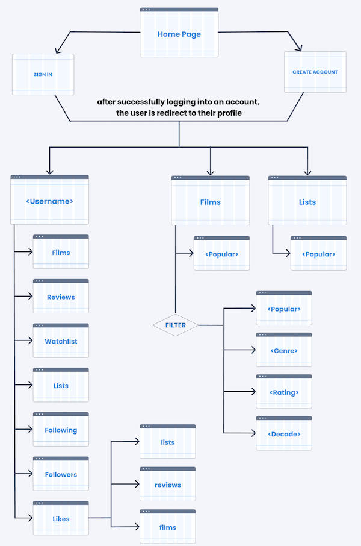

# Film Forum

## Overview

Heavily inspired, by [Letterboxd](https://letterboxd.com/), Film Forum allows users to track their watchlist, discover new films, and share their thoughts through reviews and ratings. Whether you're a causal moviegoer or a dedicated film critic, Film Forum invites you to join our community. Immerse yourself into the cinematic world and bring out your inner film critic.


## Data Model

The application will store Users, Reviews, and Films

* users can have multiple reviews, watched films, favorite films, followers, and following (via references)
* each review references a film (via references)
* each film references all reviews (via references)

An Example User:

```javascript
{
  username: "shannonshopper",
  hash: // a password hash,
  reviews: // an array of references to List documents
  watched: // a list of references to films
  favorites: // a list of references to films
  following: // a list of references to other users
  followers: // a list of references to other users
}
```

An Example Review:

```javascript
{
  user: // a reference to a User object
  film: // a referdnce to a Film
  title: "Review of Some Film",
  description: "favorite film of the year",
  rating: 3.5,
  createdAt: // timestamp
  likes: 220 // total number of likes by other users
}
```

An Example Film:

```javascript
{
  name: "Some Film",
  image: // retrieved from api 
  reviews: // a list of references to reviews
  rating: // aggregate of all reviews 
}
```

## [Link to Commented First Draft Schema](/src/models/db.mjs) 

## Wireframes

/ - homepage 

 

/films - page for showing featured films and filtered subset

 

/search - page for showing films matching query results

 

/:username - page for showing specific user's profile

## Site map



## User Stories or Use Cases

1. as a non-registered user, I can register a new account
2. as a non-registered or registered user, I can browse through films
3. as a non-registered or registered user, I can browse through lists
4. as a non-registered or registered user, I can browse through reviews
5. as a non-registered or registered user, I can browse through profiles
6. as a registered user, I can customize my profile
7. as a registered user, I can create a new review
8. as a registered user, I can delete my own review
9. as a registered user, I can add films to my watchlist
10. as a registered user, I can create a list of films
11. as a registered user, I can follow other users
12. as a registered user, I can like films
13. as a registered user, I can like reviews
14. as a registered user, I can like lists

## Research Topics

* (2 points) **CSS Framework** 
  * a collection of CSS files, classes, and styles that simplify web development. 
  * typically includes a set of predefined CSS rules and classes that avoids the need of extensive CSS code
  * promotes building responsive and customizable websites
  * `tailwind.css`

* (6 points) **Frontend Framework**
  * a collection of tools, libraries, and conventions used to streamline the creation of user interfaces
  * provides a foundation for designing and developing user interfaces
  * `React`

* (3 points) **External API**
  * a set of rules and protocols that allows an application to interact with and utilize ther services and data of another
  * allows developers to integrate more features by accessing information from third-party sources
  * without having to build everything from scratch
  * `TMDB (the movie database) API`

## [Link to Initial Main Project File](app.mjs) 

## Annotations / References Used

1. [tailwind setup docs](https://tailwindcss.com/docs/installation)
2. [tutorial on React](https://react.dev/) 
3. [TMDB setup](https://developer.themoviedb.org/reference/intro/getting-started)